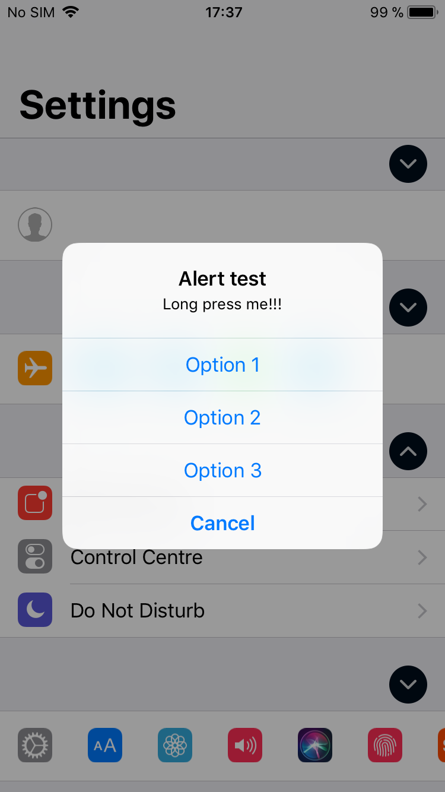
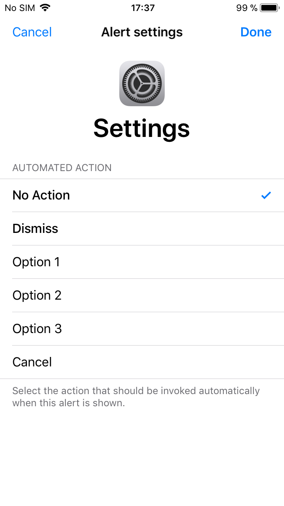
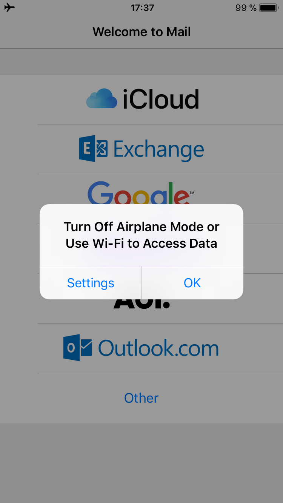
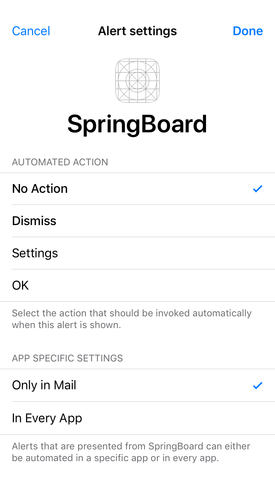

# AutoAlerts

Automate alert actions on iOS.

Inspired by: http://cydia.saurik.com/package/org.thebigboss.automa/

<p float="left">
  
  
</p>
<p float="left">
  
  
</p>

## Using Core Data in a tweak

1. Create your model with Xcode like you normally would in an app (yourmodel.xcdatamodeld).
2. Use Xcode's managed object model compiler momc on your model.
    ```
    /Applications/Xcode.app/Contents/Developer/usr/bin/momc --sdkroot /Applications/Xcode.app/Contents/Developer/Platforms/iPhoneOS.platform/Developer/SDKs/iPhoneOS12.1.sdk --iphoneos-deployment-target 10.0 /path/to/yourmodel.xcdatamodeld /path/to/some/folder/yourmodel.momd
    ```
    Specify the sdk (preferably the latest) for --sdkroot and your minimum deployment target for --iphoneos-deployment-target.
3. Copy yourmodel.momd to your Resources folder in your tweak (or somewhere else, just make sure it gets copied somewhere so you can access it on device).
4. Create a NSManagedObjectModel.
    ```Objective-C
    NSURL *url = [NSURL fileURLWithPath:@"/path/to/yourmodel.momd"];
    
    NSManagedObjectModel *model = [[[NSManagedObjectModel alloc] initWithContentsOfURL:url] autorelease];
    ```
5. Create a store description and the persistent container.
    ```Objective-C
    NSURL *storeURL = [NSURL fileURLWithPath:@"path/to/some/directory/yourmodel.sqlite"];
		
    NSPersistentStoreDescription *prop = [[[NSPersistentStoreDescription alloc] initWithURL:storeURL] autorelease];

    self.container = [[[NSPersistentContainer alloc] initWithName:@"yourmodel" managedObjectModel:model] autorelease];
    self.container.persistentStoreDescriptions = @[prop];
    ```
6. Congrats! You can now complete the creation of the Core Data stack with ```loadPersistentStoresWithCompletionHandler:``` and create objects from your entities and save them. See AACoreDataStack.m for more details.